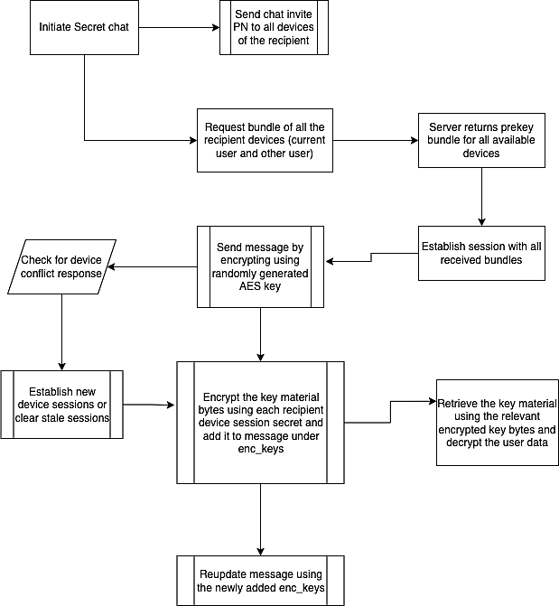

[](#installation)

[](#swift-versions-support)

# SecretChat


SecretChat is a library to create a end to end encrypted messages. This library uses [libsignal-protocol-c](https://github.com/signalapp/libsignal-protocol-c) , which is a ratcheting forward secrecy protocol that works in synchronous and asynchronous messaging
environments.

## AES encryption

All symmetric key encryption in our app will be done via AES-256 keys in AES-GCM mode. Any 12 byte deterministic IV will be used for each encryption pass through.

## Signal protocol

[Signal protocol](https://github.com/signalapp/libsignal-protocol-c) will be used for the secure key exchange SecretChat. 

## Chat message encryption

For text message encryption, a random AES-256 key generator can be used for the key material (random key for each message). Message should be encrypted using that key and the key material has to be encrypted for all available user sessions.

Message can be encrypted and payload is formed in the following format,

    base64_encoded_iv$base_64_encoded_enc_data


## Flow chart
        


---

[Requirements](#requirements) | [Features](#features) | [Installation](#installation) | [Client install time](#client-install-time) | [Building sessions](#building-sessions) | [Encryption](#encryption) | [Decryption](#decryption) | [Fingerprints](#fingerprints) | [Author](#author) | [License](#license)

## Requirements

There is no need to initialize a global
context or do any other setup before usage. `SecretChat` uses
the built-in `CommonCrypto` library for cryptographic functions. Simply:

````swift
import SecretChat
````


## Features

- End to End encrypted messages
- Easy to use
- AES-GCM key encryption/decryption
- Signal Protocol encryption/decryption
- iOS, macOS, AppleTV, watchOS, support


## Installation

To install it, simply add the following line to your Podfile:

```ruby
pod 'SecretChat'
```


## Client install time

At install time, a `SecretChat` client needs to generate its identity keys,
registration id, and prekeys.

```swift
SecretChat.initiate()

/* To Upload public identity key, public pre keys and public signed pre key to the server implement `SecretChatAPIHandlerDelegate` protocol  */
SecretChat.addApiHandler(delegate: self)
```
RegistrationId, identityKeyPair, prekeys, signedPrekey will be stored in local database.


## Building sessions

### Building a session with a downloaded pre key bundle

SecretChat needs bundle to establish session. Once pre key bundle downloaded from the server it will get processed and session will be establish for recipient with `SignalProtocol`. Additionaly session will be stored in local database. 

```swift
/* Requesting bundle from server  */
SecretChat.requestBundle(for: recipientIds)

/* Load sessions from local for particular user id  */
let sessions = RemoteSession.get(for: userId)

```


## Encryption

### AES256Key Generation

Symmetric key encryption in `SecretChat` will be done via AES-256 keys in AES-GCM mode. Random 12 byte deterministic IV will be used for each encryption pass through. 

```swift
/* To Generate AESKey  */
AES256Crypter.generateAes256()
 ```      
 
### Encrypting messages with generated AESKey

```swift
let aesEncrypt = AESEncrypt(aesKey: aesKey)
let encrypted  = aesEncrypt.perform(message: msgTextEnc)
print(encrypted.message)
 ```
 
### Encrypting AES key with signal protocol

AES key is now ready to encrypt with established session.

```swift
/* Retrive single session with userId and deviceID */
let session = RemoteSession.get(userId: userId, deviceID: deviceId)

/* Retrive all available sessions for userId */
let sessions = RemoteSession.get(for: userId)

/* Retrive all available sessions for multiple userIds */
let sessions = RemoteSession.get(for: userIds)

/* Encrypting aes key with session */
SecretSession.shared.signalEncrypt(session: session, message: msgData)
```


## Decryption

### Check message sender have session

```swift
SecretSession.shared.hasSession(name: userId, deviceId: deviceId)
```

### Decrypting in an established session

Once checked sender have session, We can start decrypt the encrypted aes key.

```swift
let aesKey = SecretSession.shared.signalDecrypt(senderUserId, deviceId: senderDeviceId, encAesKey: encKey)
```

### Decrypting AES Encrypted message with AESKey

```swift
let aes = AESEncryptedMessage(message: encMsgText, aesKey: aesKey)
if let decrypted =  aes.decrypt() {
    print(String(data: decrypted, encoding: .utf8))
}
```


## Fingerprints

It can be beneficial to compare identity fingerprints to protect against man-in-the-middle attacks.

```swift
/* Create fingerprint */
let verifySecreteChat = VerifySafety(localIdentity: localPublicKeys, remoteSessions: remoteSessions)

/* Obtain scanned data from other device */
/* Show safety */
verifySecreteChat?.getVerificationDisplayText()

/* Compare scanned fingerprint */
let equal = verifySecreteChat?.verify(code: code)
```

It's also possible to create fingerprints from several local and remote identities, e.g. in a group conversation setting.


# Legal things

## Cryptography Notice

This distribution includes cryptographic software. The country in which you currently reside may have restrictions on the import, possession, use, and/or re-export to another country, of encryption software.
BEFORE using any encryption software, please check your country's laws, regulations and policies concerning the import, possession, or use, and re-export of encryption software, to see if this is permitted.
See <http://www.wassenaar.org/> for more information.

## Author

Senthil Kumar R, senmdu96@gmail.com

## License
`SecretChat` is available under the MIT license. See the LICENSE file for more info.

`libsignal-protocol-c` is copyright (2015-2016) of Open Whisper Systems, and licensed under the GPLv3.

